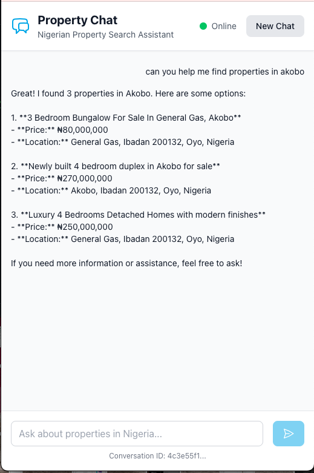
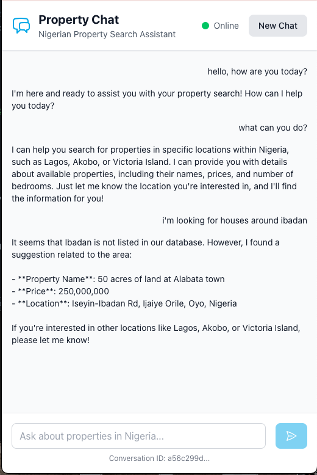

# 🏠 Property Buddy - Your AI Real Estate Assistant



**What is this?** Think of Property Buddy as a super-smart chatbot that helps people find houses and apartments in Nigeria! Instead of scrolling through boring property websites, you can just chat with an AI assistant that understands what you're looking for.

## 🌟 What Makes This Special?

This isn't just another website - it's a **full-stack AI application** that I built from scratch! Here's what it does:

### For Users (The Cool Stuff People See)
- 💬 **Chat with AI**: Ask "Show me 2-bedroom apartments in Lagos under 1 million Naira" and get instant results
- 🏘️ **Smart Property Search**: The AI understands natural language - no need to fill out complicated forms
- 📱 **Works on Any Device**: Whether you're on your phone, tablet, or computer
- 💾 **Remembers Conversations**: Your chat history is saved so you can continue where you left off

### For Developers (The Technical Magic Behind the Scenes)
- 🤖 **AI Integration**: Uses OpenAI's latest GPT-4o-mini model for intelligent responses
- 🔒 **Super Secure**: Built with enterprise-level security features
- ⚡ **Lightning Fast**: Real-time streaming responses that feel instant
- 🛡️ **Safe Database Access**: Uses Model Context Protocol (MCP) to prevent security issues



## 👔 For Recruiters & Hiring Managers

**Why This Project Matters:** This isn't just a school project - it's a production-ready application that demonstrates real-world software development skills. Here's what this project showcases:

### 🎯 Key Skills Demonstrated
- **Full-Stack Development**: Built both frontend (user interface) and backend (server) from scratch
- **AI Integration**: Successfully integrated OpenAI's GPT-4o-mini for intelligent chat functionality
- **Database Management**: Designed and implemented MySQL database with proper security
- **Modern Web Technologies**: Used Next.js 14, TypeScript, Express.js, and Tailwind CSS
- **Security Best Practices**: Implemented API authentication, rate limiting, and SQL injection prevention
- **Real-Time Features**: Built streaming chat responses using Server-Sent Events
- **Production-Ready Code**: Includes error handling, logging, testing, and deployment configurations

### 🏆 Technical Achievements
- **Zero Security Vulnerabilities**: Used parameterized queries and input validation
- **Scalable Architecture**: Built with connection pooling and proper error handling
- **Modern Development Practices**: TypeScript strict mode, ESLint, structured logging
- **API Design**: RESTful API with proper HTTP status codes and error responses
- **Performance Optimization**: Implemented caching, pagination, and efficient database queries

### 💼 Business Impact
- **User Experience**: Created an intuitive chat interface that makes property search effortless
- **Accessibility**: Mobile-responsive design that works on all devices
- **Reliability**: Built with proper error handling and monitoring
- **Maintainability**: Clean, documented code that's easy to understand and modify

## 🚀 How to Run This Project

**Don't worry if this looks complicated!** I'll explain everything step by step.

### What You Need First
- **Node.js**: This is like the engine that runs JavaScript programs (think of it like needing a specific version of a game console)
- **MySQL Database**: This is where all the property information and chat history gets stored
- **OpenAI API Key**: This is the "key" that lets the app talk to the AI (like a password for AI services)

### Step-by-Step Setup

1. **Download the Code**:
   ```bash
   git clone <repository>
   cd property-chat-system
   ```
   *This downloads all the code files to your computer*

2. **Set Up the Backend** (The "brain" of the app):
   ```bash
   cd backend
   npm install
   cp ../.env.example .env
   # Edit .env with your actual values
   npm run dev
   ```
   *This installs all the tools needed and starts the server*

3. **Set Up the Frontend** (The "face" of the app that users see):
   ```bash
   cd frontend
   npm install
   cp .env.local.example .env.local
   # Edit .env.local with backend URL
   npm run dev
   ```
   *This creates the website interface*

4. **Set Up the Database** (Where all the data lives):
   ```bash
   # Run the conversations table creation script
   mysql -h 160.79.116.246 -u admin -p agentsrequest < backend/db/conversations.sql
   ```
   *This creates the table where chat conversations are stored*

### Configuration Files (The "Settings" for the App)

**Backend Settings (.env file)**:
```env
OPENAI_API_KEY=your_openai_api_key      # Your AI password
BACKEND_API_KEY=your_backend_api_key    # Security key for the server
MYSQL_HOST=160.79.116.246              # Where the database lives
MYSQL_PORT=3306                        # Database "door number"
MYSQL_USER=admin                       # Database username
MYSQL_PASSWORD=your_password           # Database password
MYSQL_DB=agentsrequest                 # Database name
BACKEND_PORT=4000                      # Server port number
```

**Frontend Settings (.env.local file)**:
```env
NEXT_PUBLIC_API_URL=http://localhost:4000  # Where to find the backend
NEXT_PUBLIC_API_KEY=your_backend_api_key   # Security key for frontend
```

*Think of these like the settings in a video game - they tell the app where to find things and how to connect to services.*

## 📁 How the Code is Organized

Think of this like organizing your room - everything has its place!

```
/
├── backend/                 # The "brain" - handles all the smart stuff
│   ├── src/
│   │   ├── server.ts       # The main controller (like the conductor of an orchestra)
│   │   ├── config.ts       # Settings and configuration
│   │   ├── middlewares/    # Security guards and helpers
│   │   ├── routes/         # Different "doors" for different requests
│   │   ├── services/       # The AI and business logic
│   │   ├── mcp-server/     # Safe database tools
│   │   └── utils/          # Helper functions
│   ├── db/conversations.sql # Database blueprint
│   └── package.json        # List of tools needed
├── frontend/               # The "face" - what users see and interact with
│   ├── app/               # The main website pages
│   ├── lib/api.ts         # How to talk to the backend
│   └── package.json       # List of tools needed
├── ARCHITECTURE.md        # Technical design document
└── README.md             # This file you're reading!
```

**Simple Explanation**: 
- **Backend** = The kitchen in a restaurant (where the magic happens, but customers don't see it)
- **Frontend** = The dining room (what customers see and interact with)
- **Database** = The pantry (where all the ingredients/data are stored)

## 🔧 How Developers Can Use This

**For Other Developers**: If you want to build your own app that uses Property Buddy, here's how to talk to it:

### Send a Chat Message
```javascript
POST /api/chat
Headers: { "x-api-key": "your-key" }
Body: {
  "conversationId": "optional-uuid",     // Like a conversation ID
  "message": "Find 2-bedroom apartments in Lagos",  // What the user wants
  "stream": true                          // Get responses in real-time
}
```

### Load Previous Conversation
```javascript
GET /api/chats/{conversationId}
Headers: { "x-api-key": "your-key" }
```
*This gets back all the messages from a previous chat*

### Search Properties Directly (Skip the Chat)
```javascript
GET /api/properties/search?place[by]=city&place[value]=Lagos&bedrooms=2
Headers: { "x-api-key": "your-key" }
```
*This searches properties without using the AI chat - just direct database search*

**Think of these like different ways to order food:**
- **Chat API** = Talking to a waiter who understands what you want
- **Direct Search** = Looking at the menu yourself
- **Load Conversation** = Asking the waiter to remind you what you ordered before

## 🛠️ For Developers: How to Work on This Project

### Working on the Backend (The Brain)
```bash
cd backend
npm run dev        # Start the development server (like turning on your computer)
npm run build      # Create a production version (like packaging a game for sale)
npm test           # Run tests to make sure everything works
npm run lint       # Check code quality (like spell-check for code)
```

### Working on the Frontend (The Face)
```bash
cd frontend
npm run dev        # Start the website development server
npm run build      # Create a production website
npm run lint       # Check code quality
```

### Testing Everything Works
```bash
# Test the backend
cd backend
npm test

# Test the whole system with a real request
curl -X POST http://localhost:4000/api/chat \
  -H "Content-Type: application/json" \
  -H "x-api-key: dev-local-key" \
  -d '{"message": "Find properties in Lagos"}'
```

**What these commands do:**
- `npm run dev` = Start the app in "development mode" (with extra debugging info)
- `npm run build` = Create the final version that's ready for users
- `npm test` = Run automated tests to make sure nothing is broken
- `npm run lint` = Check if the code follows good practices

## 🎯 How to Use Property Buddy

### For Regular Users (The Easy Way)
1. **Open the website**: Go to http://localhost:3000
2. **Start chatting**: Type something like "Show me 2-bedroom properties in Lagos under 1 million NGN"
3. **Watch the magic**: The AI will:
   - Check if "Lagos" is a real place
   - Search for properties that match your criteria
   - Show you the results in a nice chat format
   - Remember your conversation for later

### For Developers (The Programmer Way)
```javascript
import { sendChatMessage } from './lib/api';

const response = await sendChatMessage({
  message: "Find apartments in Abuja",
  stream: true
}, (chunk) => {
  if (chunk.type === 'token') {
    console.log(chunk.data.content);  // Print each word as it comes in
  }
});
```

**What this code does**: Instead of using the website, this code talks directly to the AI and prints each word as the AI "thinks" of it (like watching someone type in real-time).

## 🔒 Security Features (Keeping Everything Safe)

**Why Security Matters**: Just like you lock your house, we need to protect the app from bad actors!

- **🔑 API Key Authentication**: Like a password - only people with the right key can use the app
- **⏱️ Rate Limiting**: Prevents spam - you can only make 100 requests every 15 minutes
- **✅ Input Validation**: Checks everything users type to make sure it's safe
- **🛡️ SQL Injection Prevention**: Protects the database from malicious code
- **🌐 CORS Protection**: Only allows requests from approved websites
- **🚨 Error Handling**: If something goes wrong, it doesn't crash - it handles it gracefully

## 📊 Monitoring (Keeping Track of Everything)

**Think of this like a fitness tracker for the app**:

- **📝 Logs**: Records everything that happens (like a diary)
- **❤️ Health Checks**: Regular "check-ups" to make sure the app is running well
- **🔍 Request Tracing**: Each request gets a unique ID (like a tracking number)
- **💰 Token Usage**: Keeps track of how much AI usage costs
- **⚡ Performance**: Measures how fast everything runs

## 🚀 Making It Live (Deployment)

**Deployment** = Making your app available for real users on the internet (like publishing a YouTube video)

### Simple Deployment
```bash
# Backend (The Brain)
cd backend
npm run build    # Create the final version
npm start        # Start the server for real users

# Frontend (The Face)
cd frontend
npm run build    # Create the final website
npm start        # Start the website for real users
```

### Advanced Deployment with Docker (Optional)
```bash
# This creates a "container" - like a portable box with everything needed
FROM node:18-alpine    # Start with a lightweight Linux system
WORKDIR /app          # Set the working directory
COPY package*.json ./  # Copy the list of tools needed
RUN npm ci --only=production  # Install only what's needed for production
COPY dist ./dist      # Copy the built app
EXPOSE 4000           # Open port 4000 for connections
CMD ["npm", "start"]  # Start the app
```

**Think of Docker like a lunchbox**: Everything your app needs is packed inside, and it can run anywhere!

## 📚 More Information

**Want to learn more?** Check out these detailed documents:

- [ARCHITECTURE.md](ARCHITECTURE.md) - How the whole system is designed
- [backend/API.md](backend/API.md) - Complete guide to all the API endpoints
- [backend/MCP_TOOLS.md](backend/MCP_TOOLS.md) - How the safe database tools work
- [backend/README.md](backend/README.md) - Backend-specific information

## 🤝 Contributing (For Other Developers)

**Want to help improve this project?** Here's how:

1. **Follow the Rules**: Use TypeScript strict mode and ESLint
2. **Test Everything**: Write tests for new features
3. **Document Changes**: Update docs when you change the API
4. **Clean Commits**: Use clear commit messages
5. **Be Safe**: Always use MCP tools for database access

## ⚠️ Important Rules

**These are like the "house rules" for this project:**

- **Database Safety**: Only the `conversations` table can be changed - don't touch the property data!
- **API Keys**: Never put passwords or keys in the code (use environment variables)
- **Rate Limits**: Be nice to the AI service - don't spam it with requests
- **Error Handling**: Always use the safe database tools (MCP tools)

## 🆘 When Things Go Wrong

### Common Problems and Solutions

**"Database connection failed"**
- Check your MySQL password in the .env file
- Make sure you can reach the database server
- Verify the database `agentsrequest` exists

**"OpenAI API error"**
- Check your OpenAI API key is correct
- Make sure you have credits in your OpenAI account
- Don't make too many requests too quickly

**"CORS errors in browser"**
- Check that the frontend URL matches the backend
- Verify the API key is set correctly
- Make sure both frontend and backend are running

### Debug Mode (For Developers)
```bash
# Backend with extra logging
LOG_LEVEL=debug npm run dev

# Frontend with verbose logging
DEBUG=* npm run dev
```

## 🎉 Conclusion

**Property Buddy** is more than just a school project - it's a real-world application that demonstrates:

- **Technical Skills**: Full-stack development, AI integration, database management
- **Security Awareness**: Proper authentication, input validation, and error handling
- **Modern Practices**: TypeScript, testing, documentation, and deployment
- **User Experience**: Intuitive chat interface that makes property search effortless

**For Students**: This project shows you can build real applications that solve real problems!

**For Recruiters**: This demonstrates production-ready development skills with modern technologies and best practices.

---

*Built with ❤️ using Next.js, Express.js, OpenAI GPT-4o-mini, and MySQL*
